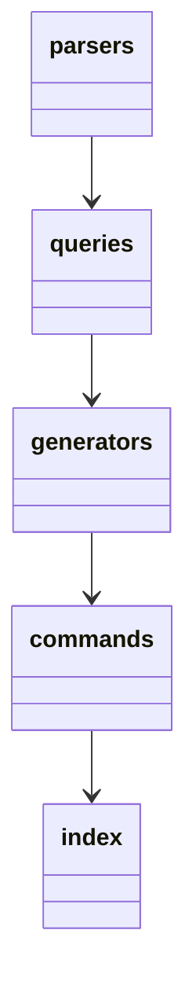

# mysql login

```sql
mysql -u root -p -h localhost -P3306
```

# mysql の hostname と port の出力コマンド

```sql
SHOW VARIABLES WHERE Variable_name = 'hostname' OR Variable_name = 'port';
```

# 依存関係


```mermaid

classDiagram
    parsers --> queries
    queries --> generators
    generators --> commands
    commands --> index

```
